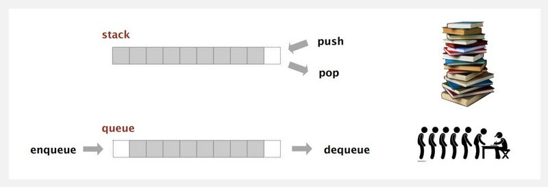

<h1 align="center">
	✏️ C - Stacks, Queues - LIFO, FIFO
</h1>
<p align="center">
	<b><i>HOLBERTON SCHOOL MONTY PROGRAM</i></b><br>
</p>
<p align="center">
	

</p>

<h3 align="center">
	<a href="#Description">Description</a>
	<span> · </span>
	<a href="#Compilation-and-testing">Testing</a>
	<span> · </span>
	<a href="#EXEMPLE">EXEMPLE</a>

</h3>

---

## 💡 MONTY BYTE CODE:

In our Holberton school group project pair programing we work on making a `MONTY PROGRAM`,

## 📝 Description: 

`Monty` is a scripting language that is first compiled to Monty ByteCode (extension .m) . It relies on a unique stack, with specific instructions to manipulate it. This project is a recreation of compiling simple Monty ByteCode files. Main focus is to create linked lists in C to emulate stacks and queues in storing and retrieving information.

<p>
<strong> FIFO </strong> a queue that operates on a first-in, first-out (FIFO) principle. This means that the request (like a customer in a store or a print job sent to a printer) is processed in the order in which it arrives
</p>

<p>
<strong> LIFO </strong> 
The order in which elements come off a stack gives rise to its alternative name, LIFO (last in, first out). Additionally, a peek operationmay give access to the top without modifying the stack. 
</p>

<p align="center">
	

</p>


## 🛠️  Compilation and testing

#### 🔧 We are compiling via:
```{r mon_bloc, echo = FALSE, WARNING = TRUE}
$ gcc -Wall -Werror -Wextra -pedantic *.c -o monty

```
### 🖥 EXEMPLE
```
@ubuntu:~/monty$ cat bytecodes/09.m 
push 1
push 2
push 3
pall
swap
pall
@ubuntu:~/monty$ ./monty bytecodes/09.m 
3
2
1
2
3
1

```


## 📂  What our file stand for:

 
## :octocat: Authors:
* [Mahdi Bani](https://github.com/Mahdi3Bani)
* [Hana Ouerghemmi](https://github.com/HanaOuerghemmi)
 

